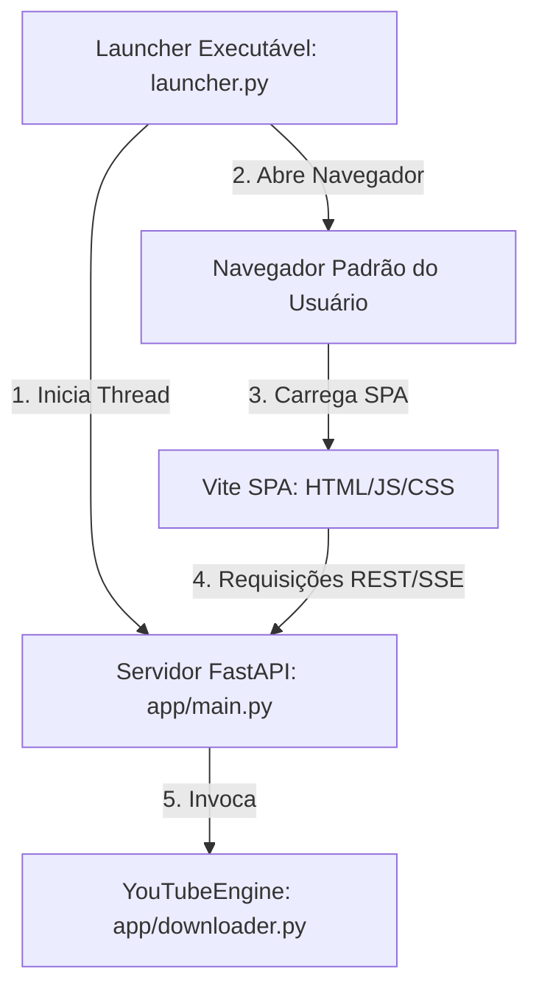

# Especificação de Design: Refatoração para Vite e FastAPI

Este documento especifica a nova arquitetura para a refatoração do **YoutubeDownloader**, migrando da interface legada em PyQt6 para uma aplicação web local alimentada por um frontend em **Vite (React + TypeScript)** e um servidor local **FastAPI (Python)**.

---

## 1. Objetivos do Sistema

- **Melhoria do Tooling & Build:** Substituir a engine de UI do PyQt6 pelo Vite para otimizar o tempo de desenvolvimento, agilidade nos builds, hot reloading e customização de interface.
- **Transição Transparente:** Manter a engine principal (`YouTubeEngine` usando `yt-dlp` e os binários de ffmpeg/qjs) intacta.
- **Experiência de Usuário Premium:** Fornecer atualizações de progresso de download em tempo real via Server-Sent Events (SSE).
- **Executável Único (Monolítico):** Permitir que o usuário compile o aplicativo em um único arquivo `.exe` empacotado que inicializa o servidor de forma silenciosa e abre o navegador padrão automaticamente.

---

## 2. Arquitetura do Sistema



### Componentes Principais

1. **launcher.py (Entry Point):**
   - Inicializa a aplicação FastAPI em uma porta local aleatória ou fixa (`8000`).
   - Usa o módulo `webbrowser` do Python para abrir a URL local no navegador padrão.
   - Mantém o processo do servidor ativo até que o usuário encerre o console ou feche a aba (controle opcional de shutdown).

2. **Backend (FastAPI):**
   - **Roteamento de Arquivos Estáticos:** Servirá os arquivos compilados da pasta `frontend/dist` na raiz (`/`).
   - **APIs de Controle (REST):** Analisar URLs de vídeo/playlist e gerenciar caminhos locais de destino.
   - **Task Queue & Threads:** Gerencia os downloads em segundo plano usando threads paralelas para evitar bloqueio do servidor, alimentando filas de progresso.
   - **Progress Streaming (SSE):** Streaming de eventos de progresso em tempo real conectados às filas de download de `yt-dlp`.

3. **Frontend (Vite / React):**
   - Construído com React, TypeScript e Vanilla CSS customizado.
   - Consome a API REST do FastAPI para controle e o canal SSE para progresso interativo das transferências.

---

## 3. Estrutura de Diretórios Proposta

```text
YoutubeDownloader/
├── app/                      # Código do Backend (FastAPI)
│   ├── __init__.py
│   ├── main.py               # Definições de rotas FastAPI
│   ├── downloader.py         # YouTubeEngine (yt-dlp inalterado)
│   ├── utils.py              # Utilitários globais de JSON/caminhos
│   └── server.py             # Script auxiliar de execução
├── frontend/                 # Código do Frontend (Vite)
│   ├── src/
│   │   ├── components/       # Componentes reusáveis (Tabs, Downloads)
│   │   ├── App.tsx           # Layout principal e controle de estado
│   │   ├── index.css         # Variáveis de design OKLCH e estilos globais
│   │   └── main.tsx
│   ├── package.json
│   ├── tsconfig.json
│   └── vite.config.ts
├── bin/                      # Binários necessários (ffmpeg.exe, qjs.exe)
├── dist_py/                  # Pasta temporária para compilação PyInstaller
├── build.bat                 # Script batch para compilar frontend e gerar EXE
├── launcher.py               # Ponto de entrada do executável compilado
├── requirements.txt          # Dependências do backend Python
└── package.json              # Configurações do monorepo (scripts npm)
```

---

## 4. Contratos de API (FastAPI)

### 4.1 REST API

#### Analisar URL Única
- **Rota:** `POST /api/analyze`
- **Payload:**
  ```json
  { "url": "string" }
  ```
- **Resposta:**
  ```json
  {
    "title": "Título do Vídeo",
    "resolutions": ["1080", "720", "480"],
    "opts": { "configurações": "internas" },
    "strategy": "camaleao-v3"
  }
  ```

#### Analisar Playlist
- **Rota:** `POST /api/analyze-playlist`
- **Payload:**
  ```json
  { "url": "string" }
  ```
- **Resposta:**
  ```json
  {
    "title": "Nome da Playlist",
    "videos": [
      { "title": "Vídeo 1", "url": "https://..." },
      { "title": "Vídeo 2", "url": "https://..." }
    ]
  }
  ```

#### Iniciar Download
- **Rota:** `POST /api/download`
- **Payload:**
  ```json
  {
    "url": "string",
    "path": "string",
    "filename": "string",
    "type": "video" | "audio",
    "quality": "string",
    "opts": { ... }
  }
  ```
- **Resposta:**
  ```json
  {
    "task_id": "uuid-v4-gerado",
    "message": "Download iniciado"
  }
  ```

#### Cancelar Download
- **Rota:** `POST /api/download/cancel/{task_id}`
- **Resposta:**
  ```json
  { "status": "cancelled" }
  ```

#### Obter Histórico de Pastas e Downloads
- **Rota:** `GET /api/settings`
- **Resposta:**
  ```json
  {
    "paths": ["C:/Users/User/Downloads", "D:/Videos"]
  }
  ```

- **Rota:** `POST /api/settings/path`
  - Adiciona um novo caminho de destino à lista.

- **Rota:** `GET /api/history`
  - Retorna o histórico de vídeos baixados anteriormente.

---

### 4.2 SSE Progress Stream

- **Rota:** `GET /api/download/progress/{task_id}`
- **Tipo de Resposta:** `text/event-stream`
- **Formato do Evento (JSON):**
  ```json
  {
    "status": "downloading" | "processing" | "finished" | "error",
    "progress": 45.2,
    "speed": "2.4MiB/s",
    "eta": "00:15",
    "message": "Baixando: 45%",
    "error_message": "Detalhes do erro se status for error"
  }
  ```

---

## 5. Design do Frontend e UI/UX (Padrão Pro Max)

### 5.1 Sistema de Cores (OKLCH)
A interface adotará um estilo de modo escuro "SaaS Industrial Premium":
- `bg-primary`: `oklch(0.12 0.015 250)` (Azul Escuro Espacial)
- `bg-card`: `oklch(0.16 0.02 250)` (Card Elevado)
- `accent`: `oklch(0.60 0.18 250)` (Ciano Real para botões e focos)
- `success`: `oklch(0.62 0.17 145)` (Verde Esmeralda para progresso/concluído)
- `text-primary`: `oklch(0.98 0.005 250)` (Branco Nítido)
- `text-secondary`: `oklch(0.70 0.01 250)` (Cinza Muted)

### 5.2 Estrutura da Página Unificada
- **Header:** Marca clean `YouTube Downloader` + Indicador de versão e botão de atualização (quando aplicável).
- **Navegação (Tabs):**
  - **Download Único:** Campo URL proeminente com botão `Analisar`. Exibe o painel de detalhes (Título, Formato, Destino, Escolha de Qualidade) em um card com transição de opacidade/escala suave após análise.
  - **Playlist:** Tabela interativa que lista os vídeos da playlist com checkbox para seleção em massa, botão `Baixar Selecionados` e console visual com logs de progresso de cada item.
  - **Histórico:** Grid responsivo exibindo os downloads passados (título, tamanho, data). Um clique no item abrirá a pasta local contendo o arquivo.

---

## 6. Fluxo de Empacotamento (Build & Release)

1. **Compilação do Frontend:**
   - O comando `npm run build` na pasta `frontend` compila a aplicação SPA React em arquivos estáticos dentro de `frontend/dist`.
2. **Bundle PyInstaller:**
   - O script `build.bat` copia os arquivos estáticos para o local correto (ou o PyInstaller os mapeia diretamente através do arquivo `.spec`).
   - O PyInstaller compila `launcher.py` incluindo a biblioteca FastAPI, uvicorn, arquivos estáticos da web e dependências do `yt-dlp`.
   - Adiciona os binários `ffmpeg.exe` e `qjs.exe` no bundle final para entrega autônoma.
